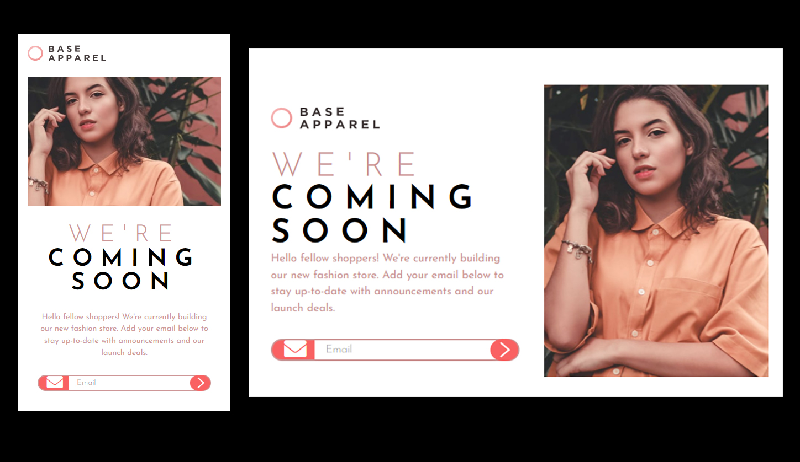

# Frontend Mentor - Interactive rating component solution

This is a solution to the [Interactive rating component challenge on Frontend Mentor](https://www.frontendmentor.io/challenges/interactive-rating-component-koxpeBUmI). Frontend Mentor challenges help you improve your coding skills by building realistic projects.

## Table of contents

- [Overview](#overview)
  - [Screenshot](#screenshot)
  - [Links](#links)
- [My process](#my-process)
  - [Built with](#built-with)
  - [What I learned](#what-i-learned)
  - [Continued development](#continued-development)
  - [Useful resources](#useful-resources)
- [Author](#author)
- [Acknowledgments](#acknowledgments)

**Note: Delete this note and update the table of contents based on what sections you keep.**

## Overview

### Screenshot



### Links

- Solution URL: (https://github.com/Junbol-Frontend-Mentor/Intro-component-with-sign-up-form)
- Live Site URL: (https://junbol-frontend-mentor.github.io/Intro-component-with-sign-up-form/)

## My process

### 🛠 Built with
- Semantic HTML5 markup 🧾
- Sass(SCSS)  Flexbox 🎨
- BEM (Block.Element.Modifier)🧾
- Mobile-first workflow 📱
- GIT/GitHub 🧾🌎
- PowerShell (CLI) 🧾
- Javascript 🤖🚀


### What I learned

- Creating all the logic in Javascript fot the form validation.
- The use of regular expressions: I have to say this was tough, this makes this challenge not for newbies 🤪. Just check the  password one 🤣.
- The use of focusout 🔍
- Using nextElementSibling to target html elements 👨‍👧‍👦.

```
Regular Expresions for validating name:
/^[A-Za-z]+$/ 😨

Regular Expresions for validating email:
/^[^\s@]+@[^\s@]+\.[^\s@]+$/ 😱

Regular Expresions for validating pssword:
/^[A-Za-z]+$/
/^(?=.*[A-Z])(?=.*\d)(?=.*[@$!%*?&])[A-Za-z\d@$!%*?&]{8,}$/ 🤪

Using focusout:
myFirstName.addEventListener("focusout", validateFirstName);

Using nextElementSibling to target html elements:
function validatePassword() {
    let passwordValue = myPassword.value;
    let passwordError = myPassword.parentElement.nextElementSibling;
    let passwordIcon = myPassword.nextElementSibling;
```

### Continued development

I would like to continue studying responsive SCSS specially with Grid + Flexbox and CSS animation, transitions and FX like parallax.

### Useful resources

- [web.dev](https://web.dev/learn/css) - This helped me for get back on track with CSS.
- [w3schools](https://www.w3schools.com/css/default.asp) - The one place to refresh stuff in practical way.

## Author

- Website - [Junier Bolivar](https://www.bolivarcreativedesign.com)
- Frontend Mentor - [Junbol](https://www.frontendmentor.io/profile/Junbol)
- Twitter - [@JunierBolivar](https://www.twitter.com/@JunierBolivar)

## Acknowledgments
